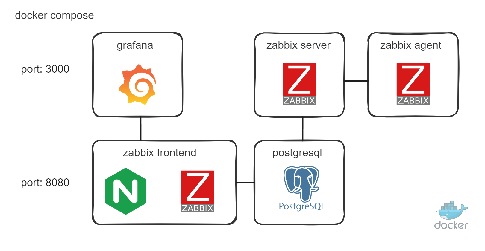
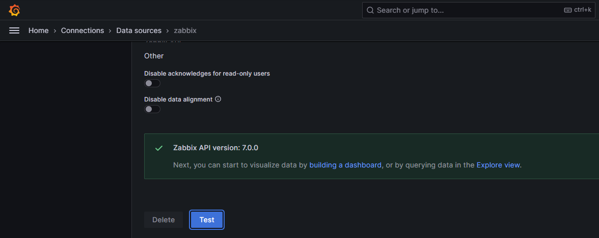

# docker compose - Zabbix NGINX PostgreSQL + Grafana

- [Official Zabbix Dockerfiles](https://github.com/zabbix/zabbix-docker)
- [Zabbix plugin for Grafana dashboard](https://github.com/grafana/grafana-zabbix)



Para quem está acostumado a usar o zabbix para coletar métricas, mas quer começar a desenhar dashboards com mais beleza

Exemplo de serviço simples docker-compose

- **Postgresql:**                16.2
- **Zabbix Server:**             7.0.0rc1 | 6.4
- **Zabbix Frontend NGINX:**     7.0.0rc1 | 6.4
- **Zabbix Agent:**              7.0.0rc1 | 6.4
- **Grafana:**                   10.3.5

### Guide

1) Clone repositório:
```
git clone https://github.com/akmalovaa/zabbix-docker.git
cd zabbix-docker
```

2) Verifique ou altere as configurações no arquivo `.env`

3) Run docker-compose:
```
docker-compose up -d
```

O primeiro lançamento leva de 1 a 2 minutos

Zabbix default user password
- login: Admin
- password: zabbix

Grafana default user password (change `grafana/grafana.ini` auth.anonymous enabled)
- login: admin
- password: 12345


Settings `Zabbix server` Host -> use DNS name for zabbix-agent


Test data source

`Grafana -> Connections -> Data sources -> zabbix -> Test`


### Debug
```
docker-compose logs --tail=1 -f
```
# Monitoramento-Zabbix
